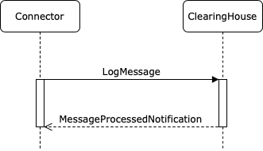

# Clearing House API v0.5.0

This is the description of the Clearing House API. All requests in the Clearing House API are modeled as HTTP POST requests, because they all expect an IDS message as input. The Clearing House uses a Trusted Connector instance to communicate with IDS Connectors. It currently accepts only HTTP multipart messages. The body parameters in this API document are *NOT* multipart messages, but IDS Infomodel messages. Please refer to your connector documentation on how to map an Infomodel message to a multipart message.

## Authentication
The Clearing House API requires all requests received to have a valid security token in the form of a DAPS token. Please refer to the IDS Communication for information on how to get a DAPS token.

## Processes

## Logging messages
The information that should be logged in the Clearing House (*logData*) is sent in the payload of a [LogMessage](http://htmlpreview.github.io/?https://github.com/IndustrialDataSpace/InformationModel/blob/feature/message_taxonomy_description/model/communication/Message_Description.htm). The log entry stored in the Clearing House consists of the payload and meta-data from the [LogMessage](http://htmlpreview.github.io/?https://github.com/IndustrialDataSpace/InformationModel/blob/feature/message_taxonomy_description/model/communication/Message_Description.htm) and is stored under the given process *pid*. Returns the newly created *id* of the log entry together with status information.

|Request method | Description |
|---|---|
|`POST /messages/log/{pid}`| Creates a new log entry under the given process id|

### Parameters
|Name|In|Type|Required|Description|
|---|---|---|---|---|
|pid|path|string|true|Process id under which the message should be logged.|
|logData|body|[LogMessage](http://htmlpreview.github.io/?https://github.com/IndustrialDataSpace/InformationModel/blob/feature/message_taxonomy_description/model/communication/Message_Description.htm)|true|[LogMessage](http://htmlpreview.github.io/?https://github.com/IndustrialDataSpace/InformationModel/blob/feature/message_taxonomy_description/model/communication/Message_Description.htm) with information that should be logged in the payload|

### Response Codes
|Status|Meaning|Description|Schema|
|---|---|---|---|
|201|[Created](https://tools.ietf.org/html/rfc7231#section-6.3.2)|Created|[MessageProcessedNotificationMessage](http://htmlpreview.github.io/?https://github.com/IndustrialDataSpace/InformationModel/blob/feature/message_taxonomy_description/model/communication/Message_Description.htm)|
|400|[Bad Request](https://tools.ietf.org/html/rfc7231#section-6.5.1)|Bad Request|[RejectionMessage](http://htmlpreview.github.io/?https://github.com/IndustrialDataSpace/InformationModel/blob/feature/message_taxonomy_description/model/communication/Message_Description.htm)|
|401|[Unauthorized](https://tools.ietf.org/html/rfc7235#section-3.1)|Unauthorized|[RejectionMessage](http://htmlpreview.github.io/?https://github.com/IndustrialDataSpace/InformationModel/blob/feature/message_taxonomy_description/model/communication/Message_Description.htm)|
|500|[Internal Server Error](https://tools.ietf.org/html/rfc7231#section-6.6.1)|Internal Error|[RejectionMessage](http://htmlpreview.github.io/?https://github.com/IndustrialDataSpace/InformationModel/blob/feature/message_taxonomy_description/model/communication/Message_Description.htm)|

### Protocol Flow with Infomodel messages
The communication between an IDS connector and the Clearing House can be described on the application level with the flow of Infomodel messages between both entities. To log information in the Clearing House the IDS connector sends a LogMessage to the Clearing House as illustrated in the following sequence diagram:



The sequence diagram shows the message flow in a non-error scenario. The connector receives a [MessageProcessedNotificationMessage](http://htmlpreview.github.io/?https://github.com/IndustrialDataSpace/InformationModel/blob/feature/message_taxonomy_description/model/communication/Message_Description.htm) as the result from the Clearing House. The payload of the contains the newly created *id* of the log entry, a *hash* of the log entry and some meta information:

```json
{ 
  "success": "String",
  "message": "String",
  "doc_id": "String",
  "hash": "String",
}
```

### Example Http Multipart Request
```http
POST /logs/messages/test-process HTTP/1.1
Host: ch-ids.aisec.fraunhofer.de
Content-Type: multipart/form-data; boundary=X-TEST-REQUEST-BOUNDARY
Accept: */*

--X-TEST-REQUEST-BOUNDARY
Content-Disposition: form-data; name="header"
Content-Type: application/json
{
  "@context" : {
    "ids" : "https://w3id.org/idsa/core/",
    "idsc" : "https://w3id.org/idsa/code/"
  },
  "@type" : "ids:LogMessage",
  "@id" : "https://w3id.org/idsa/autogen/logMessage/c6c15a90-7799-4aa1-ac21-9323b87a7xv9",
  "ids:securityToken" : {
    "@type" : "ids:DynamicAttributeToken",
    "@id" : "https://w3id.org/idsa/autogen/dynamicAttributeToken/6378asd9-480d-80df-c5cb02e4e260",
    "ids:tokenFormat" : {
      "@id" : "idsc:JWT"
    },
    "ids:tokenValue" : "eyJ0eXAiOiJKV1QiLCJraWQiOiJkZWZhdWx0IiwiYWxnIjoi....."
  },
  "ids:senderAgent" : "http://example.org",
  "ids:modelVersion" : "4.0.0",
  "ids:issued" : {
    "@value" : "2020-12-14T08:57:57.057+01:00",
    "@type" : "http://www.w3.org/2001/XMLSchema#dateTimeStamp"
  },
  "ids:issuerConnector" : {
    "@id" : "https://companyA.com/connector/59a68243-dd96-4c8d-88a9-0f0e03e13b1b"
  }
}
--X-TEST-REQUEST-BOUNDARY
Content-Disposition: form-data; name="payload"
Content-Type: application/json
{
  "@context" : "https://w3id.org/idsa/contexts/context.jsonld",
  "@type" : "ids:ConnectorUpdateMessage",
  "id" : "http://industrialdataspace.org/connectorAvailableMessage/34d761cf-5ca4-4a77-a7f4-b14d8f75636a",
  "issued" : "2019-12-02T08:25:08.245Z",
  "modelVersion" : "4.0.0",
  "issuerConnector" : "https://companyA.com/connector/59a68243-dd96-4c8d-88a9-0f0e03e13b1b",
  "securityToken" : {
    "@type" : "ids:DynamicAttributeToken",
    "tokenFormat" : "https://w3id.org/idsa/code/tokenformat/JWT",
    "tokenValue" : "eyJhbGciOiJSUzI1NiIsInR5cCI..."
}
--X-TEST-REQUEST-BOUNDARY--
```

## Query all messages of a process
Retrieves all log entries that are stored under the given *pid* in the Clearing House. The Clearing House answers the request with a [ResultMessage](http://htmlpreview.github.io/?https://github.com/IndustrialDataSpace/InformationModel/blob/feature/message_taxonomy_description/model/communication/Message_Description.htm) that contains as the payload all log entries found. Each log entry is returned as a [LogMessage](http://htmlpreview.github.io/?https://github.com/IndustrialDataSpace/InformationModel/blob/feature/message_taxonomy_description/model/communication/Message_Description.htm), i.e. the payload of the [ResultMessage](http://htmlpreview.github.io/?https://github.com/IndustrialDataSpace/InformationModel/blob/feature/message_taxonomy_description/model/communication/Message_Description.htm) contains a `json` array of [LogMessage](http://htmlpreview.github.io/?https://github.com/IndustrialDataSpace/InformationModel/blob/feature/message_taxonomy_description/model/communication/Message_Description.htm).

|Request method | Description |
|---|---|
|`POST /messages/query/{pid}`| Finds all log entries stored under the given process id *pid*|

### Parameters
|Name|In|Type|Required|Description|
|---|---|---|---|---|
|pid|path|string|true|Process id under which the log entry is stored|
|query|body|[QueryMessage](http://htmlpreview.github.io/?https://github.com/IndustrialDataSpace/InformationModel/blob/feature/message_taxonomy_description/model/communication/Message_Description.htm)|true|[QueryMessage](http://htmlpreview.github.io/?https://github.com/IndustrialDataSpace/InformationModel/blob/feature/message_taxonomy_description/model/communication/Message_Description.htm)|

### Response Codes
|Status|Meaning|Description|Schema|
|---|---|---|---|
|200|[OK](https://tools.ietf.org/html/rfc7231#section-6.3.1)|Successful operation|[ResultMessage](http://htmlpreview.github.io/?https://github.com/IndustrialDataSpace/InformationModel/blob/feature/message_taxonomy_description/model/communication/Message_Description.htm) containing a `json` array of [LogMessage](http://htmlpreview.github.io/?https://github.com/IndustrialDataSpace/InformationModel/blob/feature/message_taxonomy_description/model/communication/Message_Description.htm)|
|400|[Bad Request](https://tools.ietf.org/html/rfc7231#section-6.5.1)|Bad Request|[RejectionMessage](http://htmlpreview.github.io/?https://github.com/IndustrialDataSpace/InformationModel/blob/feature/message_taxonomy_description/model/communication/Message_Description.htm)|
|401|[Unauthorized](https://tools.ietf.org/html/rfc7235#section-3.1)|Unauthorized|[RejectionMessage](http://htmlpreview.github.io/?https://github.com/IndustrialDataSpace/InformationModel/blob/feature/message_taxonomy_description/model/communication/Message_Description.htm)|
|500|[Internal Server Error](https://tools.ietf.org/html/rfc7231#section-6.6.1)|Internal Error|[RejectionMessage](http://htmlpreview.github.io/?https://github.com/IndustrialDataSpace/InformationModel/blob/feature/message_taxonomy_description/model/communication/Message_Description.htm)|

### Protocol Flow with Infomodel messages
The communication between an IDS connector and the Clearing House can be described on the application level with the flow of Infomodel messages between both entities. To query log information in the Clearing House the IDS connector sends a QueryMessage to the Clearing House as illustrated in the following sequence diagram:


The sequence diagram shows the message flow in a non-error scenario. The connector receives a [ResultMessage](http://htmlpreview.github.io/?https://github.com/IndustrialDataSpace/InformationModel/blob/feature/message_taxonomy_description/model/communication/Message_Description.htm) as the result from the Clearing House. The payload of the contains the found log entries.

## Query a message of a process
Retrieves the log entry that is stored under the given *id* and the given process *pid* in the Clearing House. The Clearing House answers the request with a [ResultMessage](http://htmlpreview.github.io/?https://github.com/IndustrialDataSpace/InformationModel/blob/feature/message_taxonomy_description/model/communication/Message_Description.htm) that contains as the payload the log entry found. The log entry is returned as a [LogMessage](http://htmlpreview.github.io/?https://github.com/IndustrialDataSpace/InformationModel/blob/feature/message_taxonomy_description/model/communication/Message_Description.htm), i.e. the payload of the [ResultMessage](http://htmlpreview.github.io/?https://github.com/IndustrialDataSpace/InformationModel/blob/feature/message_taxonomy_description/model/communication/Message_Description.htm) contains a [LogMessage](http://htmlpreview.github.io/?https://github.com/IndustrialDataSpace/InformationModel/blob/feature/message_taxonomy_description/model/communication/Message_Description.htm).

|Request method | Description |
|---|---|
|`POST /messages/query/{pid}/{id}`| Finds the log entry with the given *id* stored under the given process id *pid*|

### Parameters
|Name|In|Type|Required|Description|
|---|---|---|---|---|
|pid|path|string|true|Process id under which the log entry is stored|
|id|path|string|true|Id of the log entry|
|query|body|[QueryMessage](http://htmlpreview.github.io/?https://github.com/IndustrialDataSpace/InformationModel/blob/feature/message_taxonomy_description/model/communication/Message_Description.htm)|true|[QueryMessage](http://htmlpreview.github.io/?https://github.com/IndustrialDataSpace/InformationModel/blob/feature/message_taxonomy_description/model/communication/Message_Description.htm)|

### Response Codes
|Status|Meaning|Description|Schema|
|---|---|---|---|
|200|[OK](https://tools.ietf.org/html/rfc7231#section-6.3.1)|Successful operation|[ResultMessage](http://htmlpreview.github.io/?https://github.com/IndustrialDataSpace/InformationModel/blob/feature/message_taxonomy_description/model/communication/Message_Description.htm) containing a `json` array of [LogMessage](http://htmlpreview.github.io/?https://github.com/IndustrialDataSpace/InformationModel/blob/feature/message_taxonomy_description/model/communication/Message_Description.htm)|
|400|[Bad Request](https://tools.ietf.org/html/rfc7231#section-6.5.1)|Bad Request|[RejectionMessage](http://htmlpreview.github.io/?https://github.com/IndustrialDataSpace/InformationModel/blob/feature/message_taxonomy_description/model/communication/Message_Description.htm)|
|401|[Unauthorized](https://tools.ietf.org/html/rfc7235#section-3.1)|Unauthorized|[RejectionMessage](http://htmlpreview.github.io/?https://github.com/IndustrialDataSpace/InformationModel/blob/feature/message_taxonomy_description/model/communication/Message_Description.htm)|
|500|[Internal Server Error](https://tools.ietf.org/html/rfc7231#section-6.6.1)|Internal Error|[RejectionMessage](http://htmlpreview.github.io/?https://github.com/IndustrialDataSpace/InformationModel/blob/feature/message_taxonomy_description/model/communication/Message_Description.htm)|

### Protocol Flow with Infomodel messages
The communication between an IDS connector and the Clearing House can be described on the application level with the flow of Infomodel messages between both entities. To query log information in the Clearing House the IDS connector sends a QueryMessage to the Clearing House as illustrated in the following sequence diagram:


The sequence diagram shows the message flow in a non-error scenario. The connector receives a [ResultMessage](http://htmlpreview.github.io/?https://github.com/IndustrialDataSpace/InformationModel/blob/feature/message_taxonomy_description/model/communication/Message_Description.htm) as the result from the Clearing House. The payload of the contains the found log entry.